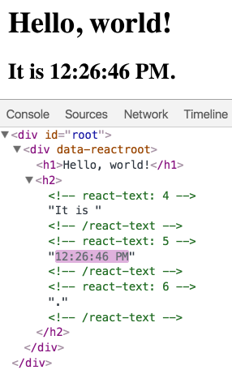

# Pure ReactJS

## Installations

- [NodeJS](https://nodejs.org/en/)
- [Microsoft Visual Studio Code](https://code.visualstudio.com/)
- [Git bash](https://git-scm.com/downloads)

## create-react-app

- [Github](https://github.com/facebook/create-react-app)

Create React App is an officially supported way to create single-page React applications. It offers a modern build setup with no configuration.

```bash
npx create-react-app [project name]
cd [project name]
npm start
```

### File Directory

```basic
node_modules
public
src
├── App.js
├── index.css
├── index.js
├── serviceWorker.js
package.json
package-lock.json
README.md
```

#### index.js

```jsx
import React from 'react';
import ReactDOM from 'react-dom';
import './index.css';
//importing App component from /.App file
import App from './App';
import * as serviceWorker from './serviceWorker';

//rendering <App /> component, so this is what will be rendered when we run npm run start
ReactDOM.render(<App />, document.getElementById('root'));

// If you want your app to work offline and load faster, you can change
// unregister() to register() below. Note this comes with some pitfalls.
// Learn more about service workers: https://bit.ly/CRA-PWA
serviceWorker.unregister();
```

#### App.js

```jsx
import React from 'react'; //must include for all react js files
import logo from './logo.svg'; //importing image as component
import './App.css';

function App() {
  return (
    //edit everything from here to customize your page 
    <div className="App">
      <header className="App-header">
        
        <p>
          Edit <code>src/App.js</code> and save to reload.
        </p>
        <a
          className="App-link"
          href="https://reactjs.org"
          target="_blank"
          rel="noopener noreferrer"
        >
          Learn React
        </a>
      </header>
    </div>
  );
}

export default App;
```

#### package.json

```jsx
{
  "name": "create-react-app",
  "version": "0.1.0",
  "private": true,
  "dependencies": {
    "@testing-library/jest-dom": "^4.2.4",
    "@testing-library/react": "^9.4.0",
    "@testing-library/user-event": "^7.2.1",
    "react": "^16.12.0",
    "react-dom": "^16.12.0",
    "react-scripts": "3.3.0"
  },
  "scripts": {
    "start": "react-scripts start",
    "build": "react-scripts build",
    "test": "react-scripts test",
    "eject": "react-scripts eject"
  },
  "eslintConfig": {
    "extends": "react-app"
  },
  "browserslist": {
    "production": [
      ">0.2%",
      "not dead",
      "not op_mini all"
    ],
    "development": [
      "last 1 chrome version",
      "last 1 firefox version",
      "last 1 safari version"
    ]
  }
}
```

---

## Hello World

From this point on, use the index.js file. 

```jsx
import React from 'react';
import ReactDOM from 'react-dom';
import './index.css';
import App from './App';
import * as serviceWorker from './serviceWorker';

// ReactDOM.render(<App />, document.getElementById('root'));

ReactDOM.render(
    <h1>Hello, world!</h1>,
    document.getElementById('root')
);

// If you want your app to work offline and load faster, you can change
// unregister() to register() below. Note this comes with some pitfalls.
// Learn more about service workers: https://bit.ly/CRA-PWA
serviceWorker.unregister();
```

This will display a heading saying "Hello, world!" on the page. 

## Introducing JSX

```jsx
const elment = <h1>Hello, world</h1>
```

This line is neither a string nor HTML.
It's JSX, and it is a syntax extension to JavaScript.

### Embedding Expressions in JSX

```jsx
const name = 'Lalaland';
const element = <h1>Hello, {name}</h1>;

ReactDOM.render(
  element,
  document.getElementById('root')
);
```

You can put any valid Javascript espression inside the curly braces in JSX. For example, `2+2`, `user.firstName` or `formatYeName(yeName)`.

```jsx
function formatYeName(yeName) {
  return yeName.firstName + ' ' + yeName.lastName;
}

const user = { 
  firstName: 'My holy first name',
  lastName: '& last name'
};

const element = {
  <h1>
    Hello, {formatYeName(user)}!
  </h1>
};

ReactDOM.render(
  element, 
  document.getElementById('root')
);
```

### Specifying Attributes with JSX

Specifying string literals as attributes:

`const element = <div tabIndex="0"></div>;`

Embedding Javascript expression in an attribute

`const element = </img>;`

Don’t put quotes around curly braces when embedding a JavaScript expression in an attribute. You should either use quotes (for string values) or curly braces (for expressions), but not both in the same attribute.

--- 

## Rendering Elements

> Elements are the smallest building blocks of React apps.

An element describes what you want to see on the screen:

`const element = <h1>Hello, world</h1>;`
Unlike browser DOM elements, React elements are plain objects, and are cheap to create. React DOM takes care of updating the DOM to match the React elements.

> One might confuse elements with a more widely known concept of “components”. We will introduce components in the next section. Elements are what components are “made of”.

### Rendering an Element into the DOM

`<div id="root"></div>`

We call this a “root” DOM node because everything inside it will be managed by React DOM.

Applications built with just React usually have a single root DOM node. If you are integrating React into an existing app, you may have as many isolated root DOM nodes as you like.

### Updating the Rendered Element

React elements are immutable. Once you create an element, you can’t change its children or attributes. An element is like a single frame in a movie: it represents the UI at a certain point in time.

So far, the only way to update the UI is to create a new element, and pass it to `ReactDOM.render()`.

```jsx
function tick() {
  const element = (
    <div>
      <h1>Hello, world!</h1>
      <h2>It is {new Date().toLocaleTimeString()}.</h2>
    </div>
  );
  ReactDOM.render(element, document.getElementById('root'));
}

setInterval(tick, 1000);
```

It calls `ReactDOM.render()` every second from a `setInterval()` callback.

> In practice, most React apps only call ReactDOM.render() once. 

### React only Updates what's Necessary

React DOM compares the element and its children to the previous one, and only applies the DOM updates necessary to bring the DOM to the desired state.



---

## Components and Props

> Components let you split the UI into independent, reusable pieces, and think about each piece in isolation. 

### Functional and Class Components

#### Functional Component

```jsx
const Button = (props) => {
  return (
    <button>{props.text}</button>
  )
}
```

#### Class Component

```jsx
class App extends Component {
  state = {count: 1};
  render() {
    <div> ... </div>
  }
}
```

### Rendering Components

```jsx
function Welcome(props) {
  return <h1>Hello, {props.name}</h1>;
}

const element = <Welcome name="Sara" />;
ReactDOM.render(
  element,
  document.getElementById('root')
);
```

1. We call `ReactDOM.render()` with the `<Welcome name="Sara" />` element.
2. React calls the Welcome component with `{name: 'Sara'}` as the props.
3. Our Welcome component returns a `<h1>Hello, Sara</h1>` element as the result.
4. React DOM efficiently updates the DOM to match `<h1>Hello, Sara</h1>`.

> **Note**: Always start component names with a capital letter.
>
> React treats components starting with lowercase letters as DOM tags. For example, `<div />` represents an HTML div tag, but `<Welcome />` represents a component and requires Welcome to be in scope.

### Composing Components

Componets can refer to other components in their output.

```jsx
function Welcome(props) {
  return <h1>Hello, {props.name}</h1>;
}

function App() {
  return (
    <div>
      <Welcome name="Sara" />
      <Welcome name="Cahal" />
      <Welcome name="Edite" />
    </div>
  );
}

ReactDOM.render(
  <App />,
  document.getElementById('root')
);
```

### Extracting Components

Consider the below component.

```jsx
function Comment(props) {
  return (
    <div className="Comment">
      <div className="UserInfo">
        
        <div className="UserInfo-name">
          {props.author.name}
        </div>
      </div>
      <div className="Comment-text">
        {props.text}
      </div>
      <div className="Comment-date">
        {formatDate(props.date)}
      </div>
    </div>
  );
}
```

It accepts `author`(object), `text`(string), and `date`(date object) as props, and describes a comment item on a social website. 

A few components can be extracted so it can be reused for other components that might need them. 

#### 1. Abstract the `Avatar` from the component 

```jsx 
function Avatar(props) {
  return (
    

  );
}
```

The `Avatar` doesn’t need to know that it is being rendered inside a `Comment`. This is why we have given its prop a more generic name: `user` rather than `author`.

We recommend naming props from the component’s own point of view rather than the context in which it is being used.

#### 2. After extracting the `Avatar` part from `Comment`

```jsx
function Comment(props) {
  return (
    <div className="Comment">
      <div className="UserInfo">
        <Avatar user={props.author} />
        <div className="UserInfo-name">
          {props.author.name}
        </div>
      </div>
      <div className="Comment-text">
        {props.text}
      </div>
      <div className="Comment-date">
        {formatDate(props.date)}
      </div>
    </div>
  );
}
```

#### 3. Extract a `UserInfo` component that renders the `Avatar`

```jsx 
function UserInfo(props) {
  return (
    <div className="UserInfo">
      <Avatar user={props.user} />
      <div className="UserInfo-name">
        {props.user.name}
      </div>
    </div>
  );
}
```

#### 4. After extracting `UserInfo` part from `Comment`

```jsx
function Comment(props) {
  return (
    <div className="Comment">
      <UserInfo user={props.author} />
      <div className="Comment-text">
        {props.text}
      </div>
      <div className="Comment-date">
        {formatDate(props.date)}
      </div>
    </div>
  );
}
```

> A good rule of thumb is that if a part of your UI is used several times (`Button`, `Panel`, `Avatar`), or is complex enough on its own (`App`, `FeedStory`, `Comment`), it is a good candidate to be a reusable component.

### Props are Read-Only

**Never** modify a component's props.

```jsx
function sum(a, b) {
  return a + b;
}
```

The above is a `pure` function because they do not attempt to change the inputs.

In contrast, this function is impure because it changes its own input:

```jsx
function withdraw(account, amount) {
  account.total -= amount;
}
```

React is pretty flexible but it has a single strict rule:

**All React components must act like pure functions with respect to their props**.

---

## State and Lifycycle

Consider the ticking clock example from [previous section](#updating-the-rendered-element), we call `ReactDOM.render() to change the rendered output.

```jsx
function tick() {
  const element = (
    <div>
      <h1>Hello, world!</h1>
      <h2>It is {new Date().toLocaleTimeString()}.</h2>
    </div>
  );
  ReactDOM.render(element, document.getElementById('root'));
}

setInterval(tick, 1000);
```

In this section, we will learn how to make the `Clock` component truly reusable and encapsulated. It will set up its own timer and update itself every second.

We can start by encapsulating how the clock looks:

```jsx
function Clock(props) {
  return (
    <div>
      <h1>Hello, world!</h1>
      <h2>It is {props.date.toLocaleTimeString()}.</h2>
    </div>
  );
}

function tick() {
  ReactDOM.render(
    <Clock date={new Date()} />,
    document.getElementById('root')
  );
}

setInterval(tick, 1000);
```

Currently, the ticking is done externally, this should be an implmentation detail of the `Clock` component.
Ideally we want to write this once and have the `Clock` component update itself: 

```jsx
ReactDOM.render(
  <Clock />,
  document.getElementById('root')
);
```

To implement this, we need to add "state" to the `Clock` component.

**State is similar to props, but it is private and fully controlled by its component.**

### React Lifecycle


### Converting a Function to a Class

1. Create an `ES6` class, with the same name, that extends `React.Component`.
2. Add a single empty method to it called `render()`.
3. Move the body of the function into the `render()` method.
4. Replace `props` with `this.props` in the `render()` body.
5. Delete the remaining empty function declaration.

```jsxs
class Clock extends React.Component {
  render() {
    return (
      <div>
        <h1>Hello, world!</h1>
        <h2>It is {this.props.date.toLocaleTimeString()}.</h2>
      </div>
    );
  }
}
```

`Clock` is now defined as a class rather than a function.

The `render` method will be called each time an update happens, but as long as we render `<Clock />` into the same DOM node, only a single instance of the `Clock` class will be used. This lets us use additional features such as local state and lifecycle methods.

### Adding Local State to Class

#### 1. Replace `this.props.date` with `this.state.date` in the `render()` method:

```jsx
class Clock extends React.Component {
  render() {
    return (
      <div>
        <h1>Hello, world!</h1>
        <h2>It is {this.state.date.toLocaleTimeString()}.</h2>
      </div>
    );
  }
}
```

#### 2. Add a class constructor that assigns the initial `this.state`:

```jsx
class Clock extends React.Component {
  constructor(props) {
    // class components should always call the base constructor with props.
    super(props);
    this.state = {date: new Date()};
  }

  render() {
    return (
      <div>
        <h1>Hello, world!</h1>
        <h2>It is {this.state.date.toLocaleTimeString()}.</h2>
      </div>
    );
  }
}
```

#### 3. Remove `date` prop from the `<Clock />` elment:

```jsx
ReactDOM.render(
  <Clock />,
  document.getElementById('root')
);
```

#### 4. Final result (without the tick)

```jsx
class Clock extends React.Component {
  constructor(props) {
    super(props);
    this.state = {date: new Date()};
  }

  render() {
    return (
      <div>
        <h1>Hello, world!</h1>
        <h2>It is {this.state.date.toLocaleTimeString()}.</h2>
      </div>
    );
  }
}

ReactDOM.render(
  <Clock />,
  document.getElementById('root')
);
```

### Adding Lifecyle Methods to a Class

- We want to *set up a timer* whenever the `Clock` is rendered to the DOM for the first time. This is called “mounting” in React.
- We also want to *clear that timer* whenever the DOM produced by the `Clock` is removed. This is called “unmounting” in React.

```jsx
componentDidMount() {
  this.timerID = setInterval(
    () => this.tick(),
    1000
  );
}
```

The `componentDidMount()` method runs after the component output has been rendered to the DOM. This is a good place to set up a timer.

We will tear down the timer in the `componentWillUnmount()` lifecycle method:

```jsx
componentWillUnmount() {
  clearInterval(this.timerID);
}
```

Finally, we will implement a method called `tick()` that the `Clock` component will run every second.

```jsx
tick() {
    this.setState({
      date: new Date()
    });
  }
```

It will use `this.setState()` to schedule updates to the component local state:

```jsx
class Clock extends React.Component {
  constructor(props) {
    super(props);
    this.state = {date: new Date()};
  }

  componentDidMount() {
    this.timerID = setInterval(
      () => this.tick(),
      1000
    );
  }

  componentWillUnmount() {
    clearInterval(this.timerID);
  }

  tick() {
    this.setState({
      date: new Date()
    });
  }

  render() {
    return (
      <div>
        <h1>Hello, world!</h1>
        <h2>It is {this.state.date.toLocaleTimeString()}.</h2>
      </div>
    );
  }
}

ReactDOM.render(
  <Clock />,
  document.getElementById('root')
);
```

### Using State Correctly

#### 1. Do not modify state directly.

```jsx
//wrong
this.state.comment = "yo";

//use setState()
this.setState({comment: 'lalala'});
```

The only place where you can assign this.state is the constructor.

#### 2. State updates may be asynchronous

React may batch multiple `setState()` calls into a single update for performance.

Because `this.props` and `this.state` may be updated asynchronously, you should not rely on their values for calculating the next state.

```jsx
//wrong
this.setState({
  counter: this.state.counter + this.props.increment
})

//use a second form of setState() that acepts a function rather than an object.
//that function will receive the previous tate as the first argument, and the props at the time the update is applied as the second argument
this.setState((state, props) => {
  return {
    counter: state.counter + props.increment
  }
});
```

#### 3. State updates are merged

```jsx
//state may contain several independent variables
constructor(props) {
  super(props);
  this.state = {
    posts: [],
    comments: []
  };
}
//but you can update them separately
componentDidMount() {
  fetchPosts().then(response => {
    this.setState({
      posts: response.posts
    });
  });

  fetchComments().then(response => {
    this.setState({
      comments: response.comments
    });
  });
}
```

The merging is shallow, so `this.setState({comments})` leaves `this.state.posts` intact, but completely replaces this.state.comments.

---

## Handling Events

- React events are named using camelCase, rather than lowercase.
- With JSX you pass a function as the event handler, rather than a string.

```jsx
//html way
<button onclick="activateLasers()">
  Activate lasers
</button>

//react way
<Button onClick={activateLasers}>
  Activate lasers
</Button>
```

Another difference is that you cannot return `false` to prevent default behavior in React. You must call `preventDefault` explicitly.

```jsx
//html way
<a href="#" onclick="console.log('The link was clicked.'); return false">
  Click me
</a>
//react way
function ActionLink() {
  function handleClick(e) {
    e.preventDefault();
    console.log('The link was clicked.');
  }

  return (
    <a href="#" onClick={handleClick}>
      Click me
    </a>
  );
}
```

When using React, you generally don’t need to call `addEventListener` to add listeners to a DOM element after it is created. Instead, just provide a listener when the element is initially rendered.

When you define a component using an ES6 class, a common pattern is for an event handler to be a method on the class. For example, this `Toggle` component renders a button that lets the user toggle between “ON” and “OFF” states:

```jsx
class Toggle extends React.Component {
  constructor(props) {
    super(props);
    this.state = {isToggleOn: true};

    // This binding is necessary to make `this` work in the callback
    this.handleClick = this.handleClick.bind(this);
  }

  handleClick() {
    this.setState(state => ({
      isToggleOn: !state.isToggleOn
    }));
  }

  render() {
    return (
      <button onClick={this.handleClick}>
        {this.state.isToggleOn ? 'ON' : 'OFF'}
      </button>
    );
  }
}

ReactDOM.render(
  <Toggle />,
  document.getElementById('root')
);
```

> You have to be careful about the meaning of this in JSX callbacks. In JavaScript, class methods are not bound by default. If you forget to bind `this.handleClick` and pass it to `onClick`, this will be `undefined` when the function is actually called.
>
> This is not React-specific behavior; it is a part of how functions work in JavaScript. Generally, if you refer to a method without `()` after it, such as `onClick={this.handleClick}`, you should bind that method.

---

## Conditional Rendering

In React, you can create distinct components that encapsulate behavior you need. Then, you can render only some of them, depending on the state of your application.

```jsx
function Greeting(props) {
  const isLoggedIn = props.isLoggedIn;
  if (isLoggedIn) {
    return <UserGreeting />;
  }
  return <GuestGreeting />;
}

ReactDOM.render(
  <Greeting isLoggedIn={false} />,
  document.getElementById('root')
);
```

### Inline if-else with conditional operator 

```jsx
render() {
  const isLoggedIn = this.state.isLoggedIn;
  return (
    <div>
      The user is <b>{isLoggedIn ? 'currently' : 'not'}</b> logged in.
    </div>
  );
}

//for larger expressions
render() {
  const isLoggedIn = this.state.isLoggedIn;
  return (
    <div>
      {isLoggedIn ? (
        <LogoutButton onClick={this.handleLogoutClick} />
      ) : (
        <LoginButton onClick={this.handleLoginClick} />
      )}
    </div>
  );
}
```

### Preventing Componet from Rendering

In rare cases you might want a component to hide itself even though it was rendered by another component. To do this return `null` instead of its render output.

```jsx
function WarningBanner(props) {
  if (!props.warn) {
    return null;
  }

  return (
    <div className="warning">
      Warning!
    </div>
  );
}

class Page extends React.Component {
  constructor(props) {
    super(props);
    this.state = {showWarning: true};
    this.handleToggleClick = this.handleToggleClick.bind(this);
  }

  handleToggleClick() {
    this.setState(state => ({
      showWarning: !state.showWarning
    }));
  }

  render() {
    return (
      <div>
        <WarningBanner warn={this.state.showWarning} />
        <button onClick={this.handleToggleClick}>
          {this.state.showWarning ? 'Hide' : 'Show'}
        </button>
      </div>
    );
  }
}

ReactDOM.render(
  <Page />,
  document.getElementById('root')
);
```

> Returning `null` from a component’s `render` method does not affect the firing of the component’s lifecycle methods. For instance `componentDidUpdate` will still be called.

---

## Lists and Keys

### Arrow functions

```jsx
//function
function lalaland(lalala) {
  return lalala + ' ' + 'weee';
}

//in arrow function
const lalaland = (lalala) => {
  return lalala + ' ' + 'weee'
};

//map list
const numbers = [1, 2, 3, 4, 5];
const doubled = numbers.map((number) => number * 2);
console.log(doubled);
```

### Basic List Component

Usually you would render lists inside a component.

```jsx
function NumberList(props) {
  const numbers = props.numbers;
  const listItems = numbers.map((number) =>
    <li>{number}</li>
  );
  return (
    <ul>{listItems}</ul>
  );
}

const numbers = [1, 2, 3, 4, 5];
ReactDOM.render(
  <NumberList numbers={numbers} />,
  document.getElementById('root')
);
```

The above code will return a warning that "Each child in a list should have a unique "key" prop.
A "key" is a special string attribute you need to include when creating lists of elements. 

Assign a key to the list items inside numbers.map() to fix the issue. 

```jsx
const listItems = numbers.map((number) =>
  <li key={number.toString()}>{number}</li>
);
```

### Keys 

Keys help React identify which items have changed, are added, or are removed. Keys should be given to the elements inside the array to give the elements a stable identity.

The best way to pick a key is to use a string that uniquely identifies a list item among its siblings. Usually the ID from data is used as keys.

```jsx
const todoItems = todos.map((todo) =>
  <li key={todo.id}>
    {todo.text}
  </li>
);
```

When you don’t have stable IDs for rendered items, you may use the item index as a key as a last resort:

```jsx
const todoItems = todos.map((todo, index) =>
  // Only do this if items have no stable IDs
  <li key={index}>
    {todo.text}
  </li>
);
```

#### Incorrect Keys Usage

Keys are only needed for elements inside the `map()` call. 

```jsx
function ListItem(props) {
  const value = props.value;
  return (
    // Wrong! There is no need to specify the key here:
    <li key={value.toString()}>
      {value}
    </li>
  );
}

function NumberList(props) {
  const numbers = props.numbers;
  const listItems = numbers.map((number) =>
    // Wrong! The key should have been specified here:
    <ListItem value={number} />
  );
  return (
    <ul>
      {listItems}
    </ul>
  );
}

const numbers = [1, 2, 3, 4, 5];
ReactDOM.render(
  <NumberList numbers={numbers} />,
  document.getElementById('root')
);
```

#### Keys must only be Unique among Siblings

Keys used within arrays should be unique among their siblings. However they don’t need to be globally unique. We can use the same keys when we produce two different arrays:

```jsx
function Blog(props) {
  const sidebar = (
    <ul>
      {props.posts.map((post) =>
        <li key={post.id}>
          {post.title}
        </li>
      )}
    </ul>
  );
  const content = props.posts.map((post) =>
    <div key={post.id}>
      <h3>{post.title}</h3>
      <p>{post.content}</p>
    </div>
  );
  return (
    <div>
      {sidebar}
      <hr />
      {content}
    </div>
  );
}

const posts = [
  {id: 1, title: 'Hello World', content: 'Welcome to learning React!'},
  {id: 2, title: 'Installation', content: 'You can install React from npm.'}
];
ReactDOM.render(
  <Blog posts={posts} />,
  document.getElementById('root')
);
```

Keys serve as a hint to React but they don’t get passed to your components. If you need the same value in your component, pass it explicitly as a prop with a different name:

```jsx
const content = posts.map((post) =>
  <Post
    key={post.id}
    id={post.id}
    title={post.title} />
);
```

With the example above, the `Post` component can read `props.id`, but not `props.key`.

---

## Forms

### Controlled Components

In HTML, form elements such as `<input>`, `<textarea>`, and `<select>` typically maintain their own state and update it based on user input. In React, mutable state is typically kept in the state property of components, and only updated with `setState()`.

We can combine the two by making the React state be the “single source of truth”. Then the React component that renders a form also controls what happens in that form on subsequent user input. An input form element whose value is controlled by React in this way is called a “controlled component”.

```jsx
class NameForm extends React.Component {
  constructor(props) {
    super(props);
    this.state = {value: ''};

    this.handleChange = this.handleChange.bind(this);
    this.handleSubmit = this.handleSubmit.bind(this);
  }

  handleChange(event) {
    //on every key input, set the state value to what user input
    this.setState({value: event.target.value});
  }

  handleSubmit(event) {
    alert('A name was submitted: ' + this.state.value);
    event.preventDefault();
  }

  render() {
    return (
      <form onSubmit={this.handleSubmit}>
        <label>
          Name:
          <input
            type="text"
            value={this.state.value}
            onChange={this.handleChange}
          />
        </label>
        <input type="submit" value="Submit" />
      </form>
    );
  }
}
```

With a controlled component, every state mutation will have an associated handler function. This makes it straightforward to modify or validate user input. For example, if we wanted to enforce that names are written with all uppercase letters, we could write `handleChange` as:

```jsx
handleChange(event) {
  this.setState({value: event.target.value.toUpperCase()});
}
```

---

## Lifting State Up